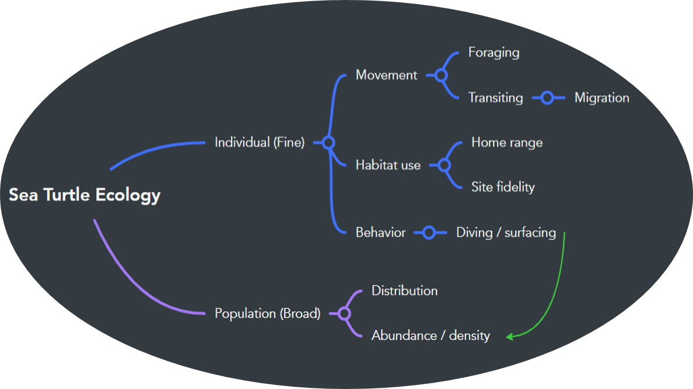
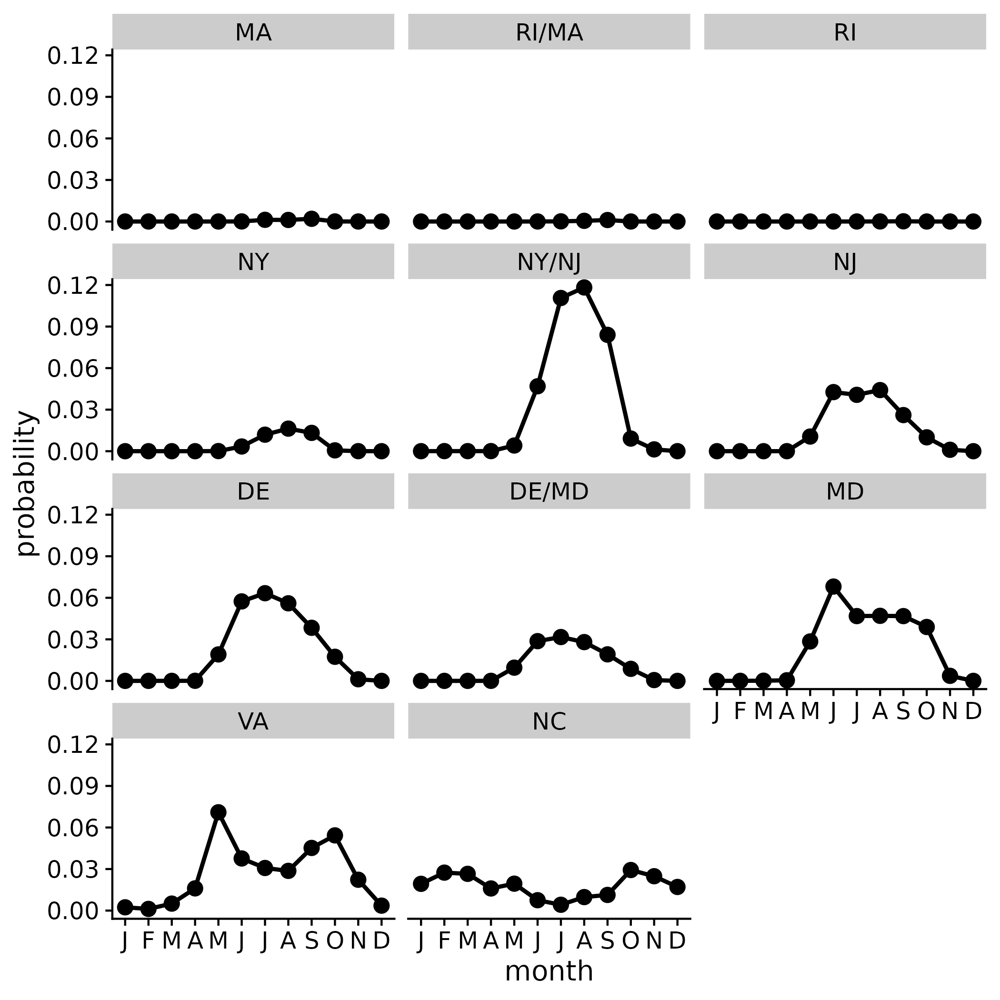

<!-- README.md is generated from README.Rmd. Please edit that file -->

```{r, include = FALSE}
knitr::opts_chunk$set(
  collapse = TRUE,
  eval = FALSE
)
library(knitr)
```

# Understanding the Intersection of Offshore Wind Development and Sea Turtles in the U.S. Atlantic


This README is a living document and will change as the repository changes.

## A Space and a Place

This GitHub repository is a place and space for discussion and collaboration among members of the NEFSC / PSD / CEB / TE program focused on **Offshore Wind Development** and **Sea Turtles**.

## Mind Mapping Sea Turtle Ecology



Exploring the relationship between individual and population risk (is this the right term?), as it relates to sea turtles and offshore wind development:

-   Scale matters
    -   Research tools differ depending on scale
-   What should we focus on?

```{r readme, echo = FALSE, eval = TRUE, results = 'hide', message = FALSE, warning = FALSE, comment = NA}
## load libraries
library(sf); sf::sf_use_s2(FALSE)
library(here)
library(dplyr)
library(raster)
library(ggplot2)
library(cowplot)
library(magrittr)
library(devtools)
library(boemWind)

## get BOEM WEAs
data('boem_wea_outlines')

## load cont shelf
lme = st_read(here::here('data', 'ne_lme_cont_shelf_shapefile', 'ne_lme_cont_shelf.shp'))

## load GAR
gar = st_read(here::here('data', 'noaa_nmfs_gar_shapefile', 'gar.shp'))

## load Cc rasters
all_files = here('data', 'cc_tagged_density_data') %>% list.files()
not_files = here('data', 'cc_tagged_density_data') %>% list.files(pattern = '*_Cubic')
keep_files = setdiff(all_files, not_files)

## get rid of overall raster
keep_files = keep_files[-which(keep_files == 'Cc_RelDen_Month_Overall.tif')]

## create a tibble 
wind_tib = tibble(file_name = keep_files) %>% 
  mutate(month = stringr::str_split(keep_files, pattern = '_') %>% purrr::map_chr(., 4) %>% tools::file_path_sans_ext() %>% factor(., levels = month.name)) %>% 
  arrange(month) 

## load tagged relative density rasters in order specified by wind_tib
file_img = purrr::map(.x = wind_tib$file_name, .f = function(.x) {
  ras = raster(here::here('data', 'cc_tagged_density_data', .x))
  raster::crs(ras) = '+proj=omerc +lat_0=35 +lonc=-75 +alpha=40 +gamma=40 +k=0.9996 +x_0=0 +y_0=0 +datum=NAD83 +units=m +no_defs'
  projectRaster(ras, crs = st_crs(4326)$proj4string) })

## format BOEM wind energy areas data
boem_wind = boem_wea_outlines %>% 
  dplyr::filter(LEASE_STAGE == 'Active') %>% 
  mutate(STATE = case_when(STATE == 'Delaware' ~ 'DE',
                           STATE == 'Maryland' ~ 'MD', 
                           STATE %in% c('Massachusetts', 'Massachussets') ~ 'MA',
                           STATE == 'New Jersey' ~ 'NJ',
                           STATE == 'New York' ~ 'NY',
                           STATE == 'North Carolina' ~ 'NC',
                           STATE == 'Rhode Island' ~ 'RI',
                           STATE == 'Rhode Island / Massachusetts' ~ 'RI/MA',
                           STATE == 'Virginia' ~ 'VA',
                           TRUE ~ STATE))

## remove CA
boem_wind %<>% dplyr::filter(STATE != 'CA')

## area calcs
wea_of_gar = sum(st_area(boem_wind)) / st_area(gar %>% st_transform(4326))
wea_of_lme = sum(st_area(boem_wind)) / st_area(lme)

## extract by WEA and month
prob_wea = purrr::map(.x = file_img, .f = function(.x) purrr::map_dbl(.x = raster::extract(.x, boem_wind %>% as_Spatial()), .f = function(.y) sum(exp(ifelse(is.null(.y), NA, .y)))))
prob_df = purrr::map_dfr(.x = seq_along(prob_wea), .f = function(.x) tibble(wea = boem_wind$STATE, month = .x, month_abb = month.name[.x], prob = prob_wea[[.x]]))
prob_df %<>% mutate(wea = factor(wea, levels = c('MA', 'RI/MA', 'RI', 'NY', 'NY/NJ', 'NJ', 'DE', 'MD', 'VA', 'NC'))) %>% group_by(wea, month, month_abb) %>% summarize(prob = sum(prob, na.rm = TRUE))
cc_pres_plt = ggplot(data = prob_df, aes(x = month, y = prob)) + 
  facet_wrap(~wea, ncol = 3) + 
  geom_point(size = 3) + 
  geom_path(size = 1) +
  scale_x_continuous(breaks = 1:12, labels = substr(month.name, 1, 1)) + 
  theme_cowplot() + 
  labs(y = 'probability')
ggsave(filename = here('imgs', 'cc_presence_weas.png'), device = 'png', bg = 'white', plot = cc_pres_plt, width = 7, height = 7, units = 'in')
```

```{r leaflet, echo = FALSE, eval = TRUE, results = 'hide', message = FALSE, warning = FALSE, comment = NA}
## load libraries
library(leaflet)
library(MetBrewer)
library(htmlwidgets)

## BOEM planning areas
plan_wind = boem_wea_outlines %>% 
  dplyr::filter(LEASE_STAGE == 'Planning')

## read in % time at surface
prop = here::here('data', 'cc_behavior_data', 'Cc_avg_prop_surf.nc') %>% raster::stack()
prop_mask = mask(prop, gar)
prop_proj = projectRaster(prop_mask, crs = st_crs(4326)$proj4string) 
prop_gar = prop_proj[[9]]

## color scale for raster image
colors = met.brewer(name = 'OKeeffe1')
color_pal = colorNumeric(colors[1:length(colors)], c(0, 1), na.color = 'transparent', reverse = TRUE)

## Leaflet
m = leaflet() %>% 
  setView(lng = -72.53855, lat = 39.73219, zoom = 7) %>%
  addProviderTiles(providers$CartoDB.DarkMatter) %>%
  addPolygons(data = gar %>% st_transform(4326), fillColor = 'transparent', color = '#D11202', popup = 'Greater Atlantic Region') %>%
  addPolygons(data = lme, fillColor = '#D11202', color = 'transparent', popup = 'Continental Shelf', group = 'C. Shelf') %>%
  addPolygons(data = boem_wind, fillColor = '#FF2A00', color = '#FF2A00', popup = ~LEASE_NUMBER_COMPANY, group = 'WEAs') %>%
  addPolygons(data = plan_wind, fillColor = '#00d5ff', color = '#00d5ff', popup = ~ADDITIONAL_INFORMATION, group = 'Planning WEAs') %>%
  addRasterImage(prop_gar, colors = color_pal, opacity = 0.3, group = '% Surf. Time (Sep)') %>%
  addLegend(pal = color_pal, values = values(prop_gar), title = '% Surface Time', group = '% Surf. Time (Sep)') %>% 
   addLayersControl(
    overlayGroups = c('C. Shelf', 'WEAs', 'Planning WEAs', '% Surf. Time (Sep)'),
    options = layersControlOptions(collapsed = TRUE)
  ) %>% 
  hideGroup(c('Planning WEAs', '% Surf. Time (Sep)'))
            
## save
saveWidget(m, file = here::here('docs', 'index.html'), title = 'Turtles & Wind')
```

### [:earth_americas:](https://jmhatch-noaa.github.io/READ-PSB-TE-Wind/) Spatial considerations

Looking at the active renewable energy leases from BOEM, we see that offshore wind development will make up roughly `r sprintf("%0.1f%%", wea_of_gar * 100)` of the Greater Atlantic Region (GAR). Zooming in a bit, to only consider the continental shelf within the GAR (preferred habitat for most sea turtles), we see that offshore wind development will make up roughly `r sprintf("%0.1f%%", wea_of_lme * 100)`.

### Case study of loggerhead turtle presence in active wind energy lease areas


<br>
Using the predictions from [Winton et al. (2018)](https://www.int-res.com/abstracts/meps/v586/p217-232/), I extracted the predicted monthly log density values of tagged loggerhead turtles to active wind energy lease areas. I then exponentiated (back transformed from the log scale) the extracted values and summed them by active wind energy lease area (aggregated by state) and month. The max value over all active wind energy lease areas and months was roughly `r sprintf("%0.1f%%", max(prob_df$prob) * 100)`.

------------------------------------------------------------------------

This repository is a scientific product and is not official communication of the National Oceanic and Atmospheric Administration, or the United States Department of Commerce. All NOAA GitHub project code is provided on an ‘as is’ basis and the user assumes responsibility for its use. Any claims against the Department of Commerce or Department of Commerce bureaus stemming from the use of this GitHub project will be governed by all applicable Federal law. Any reference to specific commercial products, processes, or services by service mark, trademark, manufacturer, or otherwise, does not constitute or imply their endorsement, recommendation or favoring by the Department of Commerce. The Department of Commerce seal and logo, or the seal and logo of a DOC bureau, shall not be used in any manner to imply endorsement of any commercial product or activity by DOC or the United States Government.
