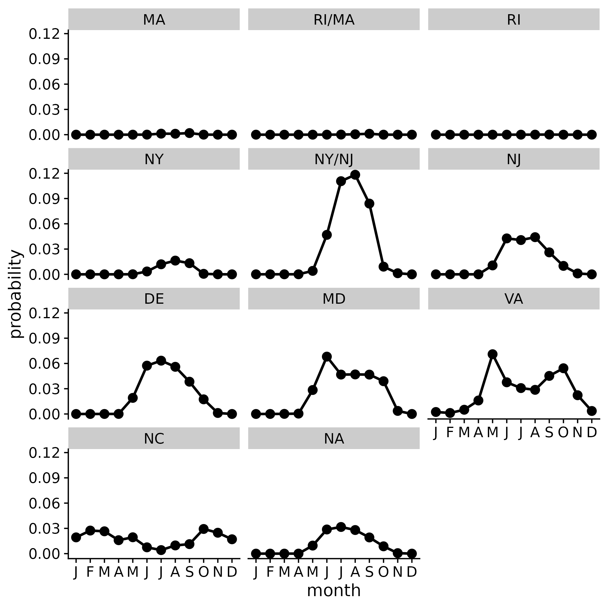

<!-- README.md is generated from README.Rmd. Please edit that file -->

# Understanding the Intersection of Offshore Wind Development and Sea Turtles in the U.S. Atlantic

This README is a living document and will change as the repository
changes.

## A Space and a Place

This GitHub repository is a place and space for discussion and
collaboration among members of the NEFSC / PSD / CEB / TE program
focused on **Offshore Wind Development** and **Sea Turtles**.

## Mind Mapping Sea Turtle Ecology

Exploring the relationship between individual and population risk (is
this the right term?), as it relates to sea turtles and offshore wind
development:

- Scale matters
  - Research tools differ depending on scale
- What should we focus on?

### [:earth_americas:](https://jmhatch-noaa.github.io/READ-PSB-TE-Wind/) Spatial considerations

Looking at the active renewable energy leases from BOEM, we see that
offshore wind development will make up roughly 2.0% of the Greater
Atlantic Region (GAR). Zooming in a bit, to only consider the
continental shelf within the GAR (preferred habitat for most sea
turtles), we see that offshore wind development will make up roughly
8.8%.

### Case study of loggerhead turtle presence in active wind energy lease areas

<figure>

<figcaption aria-hidden="true">Loggerhead turtle presence in wind energy
areas</figcaption>
</figure>

  Using the predictions from [Winton et
al. (2018)](https://www.int-res.com/abstracts/meps/v586/p217-232/), I
extracted the predicted monthly log density values of tagged loggerhead
turtles to active wind energy lease areas. I then exponentiated (back
transformed from the log scale) the extracted values and summed them by
active wind energy lease area (aggregated by state) and month. The max
value over all active wind energy lease areas and months was roughly
11.8%.

------------------------------------------------------------------------

This repository is a scientific product and is not official
communication of the National Oceanic and Atmospheric Administration, or
the United States Department of Commerce. All NOAA GitHub project code
is provided on an ‘as is’ basis and the user assumes responsibility for
its use. Any claims against the Department of Commerce or Department of
Commerce bureaus stemming from the use of this GitHub project will be
governed by all applicable Federal law. Any reference to specific
commercial products, processes, or services by service mark, trademark,
manufacturer, or otherwise, does not constitute or imply their
endorsement, recommendation or favoring by the Department of Commerce.
The Department of Commerce seal and logo, or the seal and logo of a DOC
bureau, shall not be used in any manner to imply endorsement of any
commercial product or activity by DOC or the United States Government.
